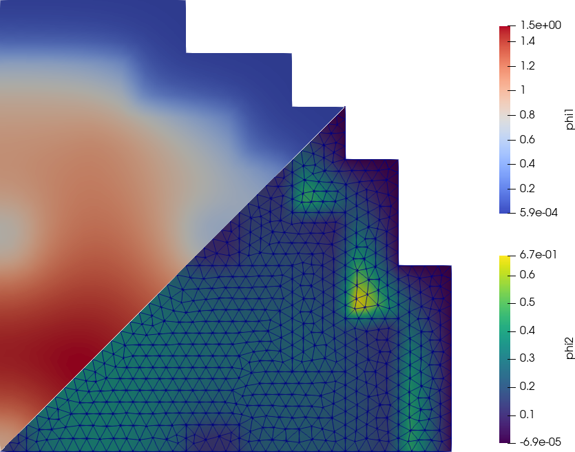
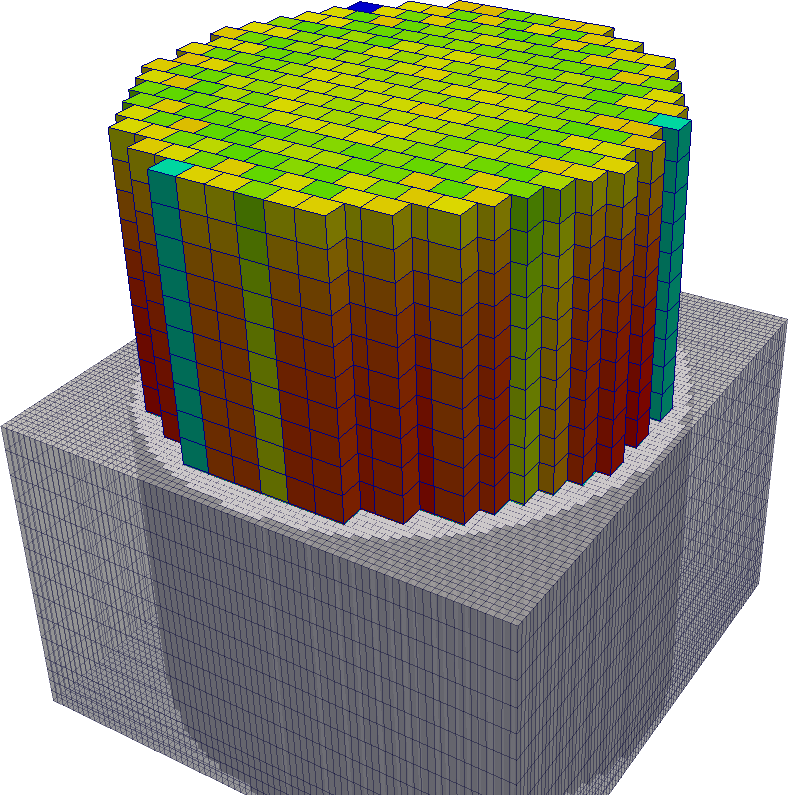

---
title: A cloud-first approach for solving core-level neutron transport 
author: Germán (Jeremy) Theler
institute: |
 Grupo Argentino de Cálculo y Análisis de Reactores \\
 Reunión Anual 2022
email: jeremy@seamplex.com
aspectratio: 169
lang: en-US
theme: default
innertheme: rectangles
fonttheme: professionalfonts
outertheme: number
colorlinks: true
sansfont: Carlito
monofont: DejaVuSansMono
header-includes: \include{syntax-feenox.tex}\include{syntax.tex}
...


## Dependencies: <https://seamplex.com/feenox>

 * FeenoX Overview Presentation, August 2021
   - <https://youtu.be/-RJ5qn7E9uE>
 * FeenoX for nuclear-related problems Presentation, December 2021
   - <https://youtu.be/e8kFmFOsbPk>
 * FeenoX hands-on tutorial. Science Circle, on-line course. October 2022
   - <https://youtu.be/b3K2QewI8jE>
 * FeenoX, a cloud-first free and open source finite-element(ish) tool. Science Circle, on-line course. November 2022.
   - <https://youtu.be/EZSjFzJAhbw>

. . .

```terminal
$ feenox
FeenoX v0.2.165-gd8b5b05
a cloud-first free no-fee no-X uniX-like finite-element(ish) computational engineering tool

usage: feenox [options] inputfile [replacement arguments] [petsc options]

  -h, --help         display options and detailed explanations of commmand-line usage
  -v, --version      display brief version information and exit
  -V, --versions     display detailed version information
  --pdes             list the types of PROBLEMs that FeenoX can solve, one per line

Run with --help for further explanations.
$
```


## Why $\rightarrow$ How $\rightarrow$ What

   
\centering 

\centering <https://www.youtube.com/watch?v=u4ZoJKF_VuA>

## 

\centering 


## Experimental Physics\ I---2004

### Damped oscillator

$$
m \cdot \ddot{x} + b \cdot \dot{x} + c \cdot x = 0
$$


. . .

### Question (by me)

Why is the damping term $b \cdot \dot{x}$ linear with the velocity?

. . .

### Answer (by Manolo Tovar)

Because it is easier that way.


## Pedestrians/drivers dichotomy

:::::::::::::: {.columns}
::: {.column width="50%"}
\onslide<1->{\begin{center}\includegraphics[height=5cm]{pedestrian.jpg}\end{center}}
:::

::: {.column width="50%"}
\onslide<2>{\begin{center}\includegraphics[height=5cm]{user.jpg}\end{center}}
:::
::::::::::::::

\vspace{1cm}

:::::::::::::: {.columns}
::: {.column width="40%"}
 1. We all are
 2. Some of us are also
:::

::: {.column width="30%"}
 * pedestrians
 * drivers
:::

. . .

::: {.column width="30%"}
 * users
 * developers
:::
::::::::::::::


## The goal of the game: to solve PDEs

\newcommand{\omegaversor}{\boldsymbol{\hat{\Omega}}}
\newcommand{\omegaprimaversor}{\boldsymbol{\hat{\Omega}^\prime}}


\begin{multline*}
 \sqrt{\frac{m}{2E}} \frac{\partial}{\partial t} \left[ \psi(\mathbf{x}, \omegaversor, E, t) \right]
 + \omegaversor \cdot \text{grad} \left[ \psi(\mathbf{x}, \omegaversor, E, t) \right]
 + \Sigma_t(\mathbf{x}, E) \cdot \psi(\mathbf{x}, \omegaversor, E, t) = \\
 \int_{0}^{\infty} \int_{4\pi} \Sigma_s(\mathbf{x}, \omegaprimaversor \rightarrow \omegaversor, E^\prime \rightarrow E) \cdot \psi(\mathbf{x}, \omegaprimaversor, E^\prime, t) \, d\omegaprimaversor \, dE^\prime \\
+ \frac{\chi(E)}{4\pi} \int_{0}^{\infty} \int_{4\pi} \nu\Sigma_f(\mathbf{x}, E^\prime) \cdot \psi(\mathbf{x}, \omegaprimaversor, E^\prime, t) \, d\omegaprimaversor \, dE^\prime
+ s(\mathbf{x}, \omegaversor, E, t)
\end{multline*}


\begin{multline*}
 \sqrt{\frac{m}{2E}} \frac{\partial}{\partial t} \Big[ \phi(\mathbf{x}, E, t) \Big]
 - \text{div} \Big[ D(\mathbf{x}, E) \cdot \text{grad} \left[ \phi(\mathbf{x}, E, t) \right] \Big]
 + \Sigma_t(\mathbf{x}, E) \cdot \phi(\mathbf{x}, E, t)
 = \\
\int_{0}^{\infty} \Sigma_{s_0}(\mathbf{x}, E^{\prime} \rightarrow E)  \cdot \phi(\mathbf{x}, E^\prime, t) \, dE^\prime +
\chi(E) \int_{0}^{\infty} \nu\Sigma_f(\mathbf{x}, E^\prime) \cdot \phi(\mathbf{x}, E^\prime, t) \, dE^\prime
+ s_0(\mathbf{x}, E, t)
\end{multline*}


## Neutronic (and in general scientific) sofware


### As users we had to deal with

 * Fortran\ 77
 * Windows\ XP
 * Insane input schemes
 * Insane output schemes
 * Structured grids only
 * “Finite differences”
 * NDAs, weird licensing terms, etc.
 * Lack of version control, traceability, etc.
    - ...yet regulatory agencies speak about QA!
 * ...
 * Add your own annoyance/nuisance to the list

. . .
 
### Why?

Same answer as with the linear term.

. . .

Because it is easier---for **developers**---that way.


## First-hand example #1

Time-dependent BCs as polynomials of time.

. . .

### Developer-easy/user-hard approach

Give me the coefficients $a_i$ in

$$
f(t) = a_0 + a_1 \cdot t + a_2 \cdot t^2 + ...
$$

. . .

### What if the user...

 * ...writes her polynomial as $f(t) = t \cdot (t-1)$?
 * ...wants to use other functions besides polynomials?

. . .

### User-easy/developer hard approach

Implement an algebraic expression parser.

 * Use one of the many one available as free & open source software.^[We would need a whole day to dicuss FOSS in nuclear.]
 * Write one from scratch.

 
## “The cloud”

\centering

{width=60%}

. . . 
 
“cloud” = somebody else’s computer\onslide<3>{\alert{s} $\Rightarrow$ infinite scalability!\\(One of the many reasons Jeff Bezos is the wealthiest bald)}


## 

\centering 
 
 
## What does “cloud first” mean?

\centering 
cloud first $\neq$ cloud friendly

. . .

### Cloud checklist

:::::::::::::: {.columns}
::: {.column width="50%"}
 * Cloud-first architecture
   - GNU/Linux
 * Clean I/O
   - JSON
   - YAML
   - Open & well-stablished formats
 * Massive parallelization
   - MPI
 * Domain decomposition
   - Metis
:::

::: {.column width="50%"}
 * Hearbeat thread + Watchdog process
 * Orchestration
   - Spawning of virtual servers
   - Containerization
   - Back end $\leftrightarrow$ front end communication
 * Code traceability 
   - Git
 * Continuous integration
   - Unit, regression & integration tests
:::
::::::::::::::

 
### TL;DR 

Follow the Unix philosophy!
Grab a copy of Eric Raymond’s “The Art of Unix programming.”^[A word game on Donald Knuth’s “The Art of Computer Programming.”]

## First-hand example #2: CAEplex

\centering
{width=70%}

. . .

\centering
{width=70%}

## First-hand example #3: Onscale

{width=70%}

## Domain decomposition

:::::::::::::: {.columns}
::: {.column width="30%"}


:::

::: {.column width="70%"}
 * Not an easy problem

 * There is not an unique solution

 * There are a lot of parameters

 * Even structured grids might end up as unstructured grids!


### Fact

If we as **developers** assumed we have to deal with unstructured grids---even though it is **harder** for us---we could have side benefits as well.


### Homework #1

How would you split CNA2's core for an arbitrary number\ $n$ of processes?


:::
::::::::::::::


## Three-dimensional domain decomposition


### Homework #2

What's wrong with this decomposition?


## Side effects: IAEA 2D/3D PWR benchmark (1976)

:::::::::::::: {.columns}
::: {.column width="40%"}
{width=90%}
:::

::: {.column width="60%"}
{width=85%}
:::
::::::::::::::


## Simple problems ought to need simple inputs

:::::::::::::: {.columns}
::: {.column width="50%"}

```{.feenox include="iaea-2dpwr.fee"}
```

:::

::: {.column width="50%"}

```terminal
$ gmsh -2 iaea-2dpwr-quarter.geo
$ [...]
$ gmsh -2 iaea-2dpwr-eighth.geo
$ [...]
$ feenox iaea-2dpwr.fee quarter
keff =  1.02986
$ feenox iaea-2dpwr.fee eighth
keff =  1.02975
$
```

\centering {width=75%}

:::
::::::::::::::

\centering <https://www.seamplex.com/feenox/examples/#iaea-2d-pwr-benchmark>

\centering


## First-hand example #4: tables

:::::::::::::: {.columns}
::: {.column width="55%"}


:::

::: {.column width="45%"}

\bigskip

 * Top is a table from a publication by a multi-billion dollar agency
   - Looks like Word/Excel
 * Bottom is a PDF from FeenoX output piped through
   - AWK
   - \LaTeX

\vspace{1cm}

. . .

 * Easy is the enemy of the good-looking
:::
::::::::::::::


## 2D IAEA PWR Benchmark with unstructured grids---2013

:::::::::::::: {.columns}
::: {.column width="50%"}
\centering 
:::

::: {.column width="50%"}
\centering 
:::
::::::::::::::

## 2D IAEA PWR Benchmark with one-eighth symmetry---2013

:::::::::::::: {.columns}
::: {.column width="50%"}
\centering 
:::

::: {.column width="50%"}
\centering 
:::
::::::::::::::


## Steady-state core-level neutronic calculations

:::::::::::::: {.columns}
::: {.column width="50%"}
\centering {width=60%}
:::

::: {.column width="50%"}
\centering {width=60%}
:::
::::::::::::::


:::::::::::::: {.columns}
::: {.column width="33%"}
{width=80%}
:::

::: {.column width="34%"}
{width=80%}
:::

::: {.column width="33%"}
{width=70%}
:::
::::::::::::::


## Transient emergency boron injection---CFD

\centering 


## Transient emergency boron injection---core-level neutronics

:::::::::::::: {.columns}
::: {.column width="50%"}
\centering {width=80%}
:::

::: {.column width="50%"}
\centering {width=80%}
:::
::::::::::::::


## Transient emergency boron injection---cell-level neutronics


\centering {width=70%}


\centering {width=80%}


## Side effect: the $S_2$ Stanford Bunny

:::::::::::::: {.columns}
::: {.column width="50%"}

\centering {height=4cm}

:::
::: {.column width="50%"}

\vspace{1cm}

 * One-group neutron transport
 * The Stanford Bunny as the geometry
 * $S_2$ method in 3D (8 angular directions)
 * Finite elements for spatial discretization

:::
::::::::::::::


:::::::::::::: {.columns}
::: {.column width="25%"}
\centering {height=2cm}
:::
::: {.column width="25%"}
\centering {height=2cm}
:::
::: {.column width="25%"}
\centering {height=2cm}
:::
::: {.column width="25%"}
\centering {height=2cm}
:::
::::::::::::::
:::::::::::::: {.columns}
::: {.column width="25%"}
\centering {height=2cm}
:::
::: {.column width="25%"}
\centering {height=2cm}
:::
::: {.column width="25%"}
\centering {height=2cm}
:::
::: {.column width="25%"}
\centering {height=2cm}
:::
::::::::::::::


## Side effect: cube-sphere

<https://seamplex.com/feenox/examples/#cube-spherical-bare-reactor>

:::::::::::::: {.columns}
::: {.column width="20%"}
\centering \onslide<1->{\includegraphics{cubesphere-0.png}}
:::
::: {.column width="20%"}
\centering \onslide<3->{\includegraphics{cubesphere-25.png}}
:::
::: {.column width="20%"}
\centering \onslide<3->{\includegraphics{cubesphere-50.png}}
:::
::: {.column width="20%"}
\centering \onslide<3->{\includegraphics{cubesphere-75.png}}
:::
::: {.column width="20%"}
\centering \onslide<2->{\includegraphics{cubesphere-100.png}}
:::
::::::::::::::

\centering \onslide<4->{\includegraphics[width=0.9\linewidth]{cubesphere.pdf}}


## Conclusions

:::::::::::::: {.columns}
::: {.column width="50%"}

 * Developers should make users' life easier, not the other way round.
   - We all are users
   - Some of us are also developers
 * 21st century
    - Cloud-first approach $\neq$ cloud friendly
    - Infinite scalability
 * The solution comes from one of the many 20th century approaches
    - The Unix philosophy!
 * Embrace free and open source software
    - Especially libraries!
 * Massive parallelization needs domain decomposition methods
    - Use unstructured grids!
    - See first bullet again.

:::

. . .

::: {.column width="50%"}


### My proposal

 * FeenoX---formerly known as
    - milonga
    - Fino
    - wasora

 * a cloud-first free no-fee no-X uniX-like finite-element(ish) computational engineering tool

 * <https://www.seamplex.com/feenox>

:::
::::::::::::::

. . .

\centering <https://www.youtube.com/watch?v=Q-lKK4A2OzA>

